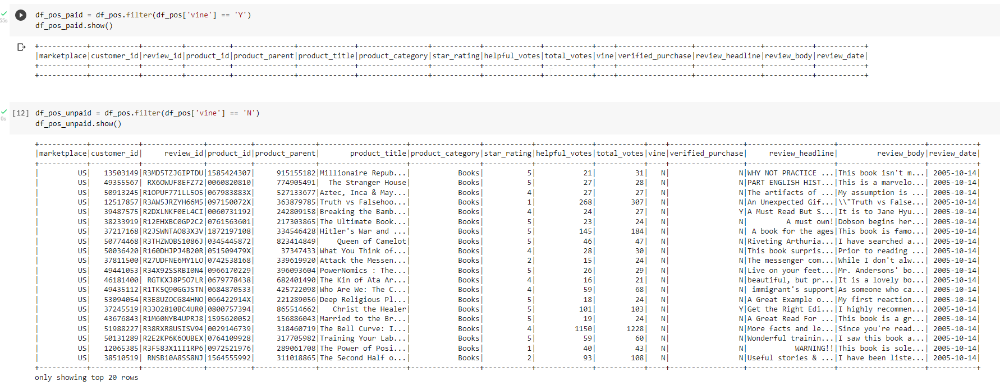
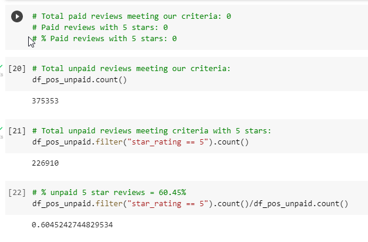

# Amazon_Vine_Analysis

## Overview
The purpose of this analysis is explore an Amazon review dataset and determine whether paid Vine reviews are biased towards positivity.

For this analysis, an Amazon dataset was accessed and cleaned using PySpark in a Google Colab notebook. The resulting tables were loaded into postgresql tables.

Initially, I attempted to do the final analysis of the cleaned data via SQL, but after exporting the data to a CSV and deleting the Amazon RDS instance, loading the CSV back into a different, non-Amazon-linked database took too long to be practical. I therefore uploaded the Vine table to an S3 bucket and did the analysis in Spark instead.

## Results

Unfortunately, I did not realize until quite late that I had not picked a good dataset for this analysis. Even before cleaning, there were only 2 Vine reviews in the entire dataset, and neither met the minimum number of total reviews to be considered. Therefore, the only numbers to be analyzed are for unpaid, non-Vine reviews.

* Total number of unpaid reviews: 375353
* Number of unpaid 5-star reviews: 226910
* Percentage of unpaid reviews with 5 stars: 60.45%

## Summary

Since there are no Vine reviews in the final data considered, it is impossible to determine whether the Vine program contributes to positivity bias. 

However, the fact that over 60% of unpaid reviews had 5 stars suggests that there is positivity bias that has not been accounted for elsewhere in this analysis. Perhaps 5 star reviews are more likely to be voted "helpful", or perhaps unpaid reviewers are only likely review books that they really loved or really hated. Analysis of two further points would therefore help to determine where this positivity bias is most concentrated:
* The overall distribution of ratings in unpaid reviews
* The likelihood that a review with a given rating will be voted helpful